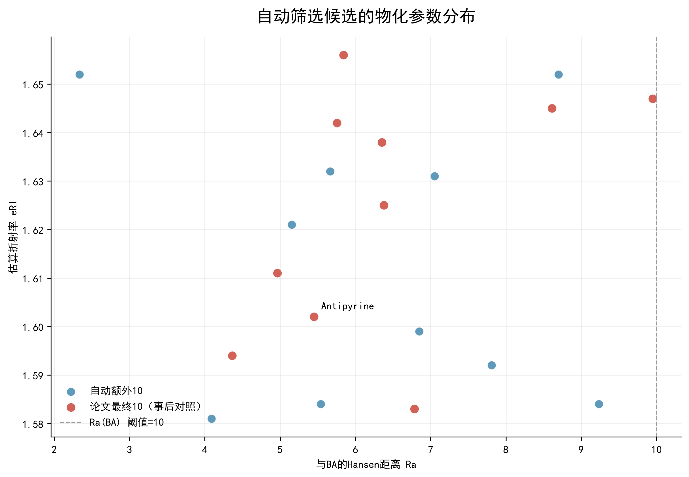

# 自动筛选框架：SeeThrough 参考演示 1.0

本项目是一个用于颅骨透明化试剂候选物筛选的研究原型。它将 SeeThrough 论文补充数据中的候选物，经过可配置的数值规则、RDKit 结构处理和 Hansen 溶解度参数距离计算，形成可追溯的候选筛选报告。

> 研究原型，不用于直接证明安全性或临床适用性。

## 当前验证数据与结果

- 验证输入：`数据/论文原始数据/` 中的 SeeThrough 补充数据表。
- 当前水相候选计算链：**1619 → 1373 → 1297 → 225 → 41 → 20**。
- 自动规则得到 20 个候选；论文最终 10 个候选在自动候选中恢复 **10/10**。
- 可查看代表性 [Excel 筛选报告](数据/导出结果/SeeThrough规则筛选演示报告.xlsx) 和两张结果图。




## 软件界面截图


## 技术栈

Python、Streamlit、RDKit、Hansen 距离、pandas/openpyxl 与可配置规则引擎。

## 安装与启动

建议使用 Python 3.11 或与 RDKit 兼容的 Python 环境。

```powershell
python -m venv .venv
.\.venv\Scripts\Activate.ps1
pip install -r requirements.txt
streamlit run 启动程序.py
```

运行测试：

```powershell
pytest
```

本地演示不需要 API 密钥。若启用可选的在线毒性查询，请仅在本机环境变量中设置 `COMPTOX_API_KEY`；不要创建或提交 `.env`、令牌或私人导入表格。

## 已实现功能

- SeeThrough 补充数据导入、清理、字段映射与数据血缘记录；
- RDKit 结构映射及常用分子描述符计算；
- Hansen 距离计算；
- 可配置的数值规则筛选与逐步候选数量统计；
- 筛选结果、规则明细、候选对照及图表导出为 Excel/PNG；
- Streamlit 页面用于候选导入、化学信息、规则筛选、毒性证据查看、配方构建、实验记录、实验优化和透明化预测的工作流入口。

### 模块状态

| 模块 | 状态 | 输入 | 输出 | 测试 |
| --- | --- | --- | --- | --- |
| 论文/通用候选导入、字段映射与身份处理 | 已实现 | Excel/CSV 候选表和字段映射配置 | 标准化候选记录、身份映射/冲突记录 | `测试/插件单独测试/论文表格导入测试.py`、`补充数据2导入清理测试.py`、`属性合并测试.py` |
| RDKit 描述符与 Hansen 距离 | 已实现 | 候选化学名称/结构、论文物化字段 | 结构映射、分子描述符、与 BA/VA 的 Hansen 距离 | `RDKit真实候选描述符测试.py`、`汉森距离计算测试.py`、`补充数据2汉森距离测试.py` |
| SeeThrough 规则筛选和 Excel/图表导出 | 已实现 | 标准化候选记录和可配置阈值 | 逐步筛选记录、20 个自动候选、报告和图表 | `规则筛选演示测试.py`、`补充数据2规则筛选测试.py`、`图表导出测试.py` |
| 毒性证据视图 | 部分实现 | 本地/可选在线证据、GHS 提示 | 证据表、警示与接口状态 | `身份与毒性流程测试.py` |
| 高斯过程（GP）透明化预测 | 接口预留，当前演示未启用 | 特征表与训练数据接口 | 预测接口契约 | 相关接口测试随未来模型数据提供 |
| BoTorch 实验优化 | 接口预留，当前演示未启用 | 实验历史与优化目标接口 | 优化接口契约 | 相关接口测试随未来实验数据提供 |

## 尚未实现或尚未验证的范围

- 本项目尚不是经过前瞻性实验验证的透明化效果预测系统；
- 实验优化与预测页面不构成已验证的实验设计或临床决策工具；
- 未提供面向任何给药途径、物种或人群的安全性结论。

### 为什么毒性模块暂不作为淘汰规则

毒性信息的证据质量、物种、给药途径、剂量和终点并不一致。当前模块将其作为可追溯的证据展示和警示，不把不完整或不可比的证据自动转为候选淘汰条件。任何安全性判断都应由适当的实验、毒理学评价和研究伦理流程完成。

## 数据来源、引用与许可

本仓库没有重新发布论文 PDF，也没有复制论文中可能含第三方权利的插图。筛选规则和演示数据参考：

> Liu, Xinyi; Uchigashima, Motokazu; Oomoto, Ikumi; Saito, Yoshihito; Uchida, Hitoshi; Oginezawa, Shinya; Masuda, Keiko; Satoh, Daisuke; Abe, Manabu; Sakimura, Kenji; Shimizu, Yoshihiro; Murayama, Masanori; Tainaka, Kazuki; and Mikuni, Takayasu. *SeeThrough: a rationally designed skull clearing technique for in vivo brain imaging*. Nature Communications 16, 7584 (2025). DOI: [10.1038/s41467-025-62836-1](https://doi.org/10.1038/s41467-025-62836-1).

Nature 将文章主体标为 CC BY 4.0；个别单独注明来源的第三方素材不在该许可范围内。`数据/论文原始数据/` 中的表格仅用于此研究演示，程序运行时会进行字段/类型清理、数值规则计算和结构映射等处理。完整的署名、许可与修改说明见 [THIRD_PARTY_NOTICES.md](THIRD_PARTY_NOTICES.md)。

## 版权与复用

Copyright © 2026 项目作者。No license is granted for reuse, modification, or redistribution.
